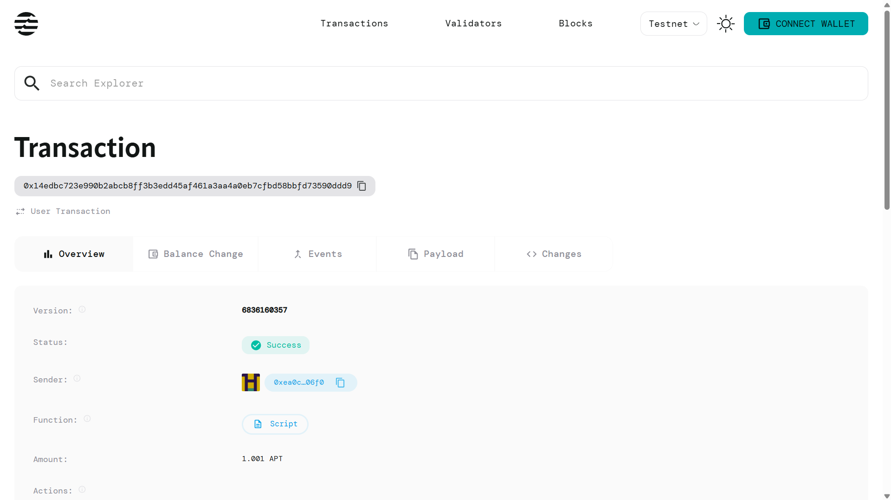

# Token Allowance System

## Project Description

The Token Allowance System is a smart contract implementation that provides approval and allowance mechanisms for delegated transfers on the Aptos blockchain. This system enables token holders to grant permission to third parties (spenders) to transfer tokens on their behalf, up to a specified limit. This functionality is essential for creating decentralized applications that require automated token transfers, such as decentralized exchanges, payment processors, and automated trading systems.

## Project Vision

Our vision is to create a secure, efficient, and user-friendly token allowance system that serves as a foundational building block for the Aptos DeFi ecosystem. By implementing standardized approval and allowance mechanisms, we aim to:

- Enable seamless integration with decentralized applications
- Provide users with granular control over their token permissions
- Establish a secure framework for delegated token transfers
- Foster innovation in automated financial services on Aptos
- Create interoperability standards for token management across different dApps

## Key Features

### 🔐 **Secure Approval System**
- Token owners can approve specific addresses to spend tokens on their behalf
- Granular control over spending limits for each approved spender
- Automatic allowance tracking and updates after each transfer

### 💰 **Delegated Transfer Mechanism**
- Approved spenders can transfer tokens directly from owner's account to any recipient
- Real-time allowance verification to prevent unauthorized transfers
- Automatic deduction of transferred amounts from approved allowances

### 🛡️ **Built-in Security Features**
- Comprehensive error handling for insufficient allowances
- Address validation to ensure only authorized transfers
- Overflow protection for allowance calculations

### ⚡ **Gas Optimized Operations**
- Efficient storage management using Aptos Table data structure
- Minimal computational overhead for approval and transfer operations
- Optimized for high-frequency trading and automated systems

### 🔄 **Dynamic Allowance Management**
- Update existing allowances without resetting
- Support for multiple simultaneous approvals per token owner
- Flexible allowance modification and revocation capabilities

## Future Scope

### Phase 1: Enhanced Security Features
- Implementation of time-based allowance expiration
- Multi-signature approval requirements for large allowances
- Integration with hardware wallet signing for enhanced security

### Phase 2: Advanced Functionality
- Batch approval operations for multiple spenders
- Percentage-based allowances relative to token balance
- Allowance delegation chains (spender can re-delegate permissions)

### Phase 3: DeFi Integration
- Integration with decentralized exchange protocols
- Support for automated market maker (AMM) interactions
- Compatibility with yield farming and staking protocols

### Phase 4: Cross-Chain Compatibility
- Bridge integration for cross-chain allowance management
- Interoperability with other blockchain token standards
- Universal allowance protocol development

### Phase 5: Analytics and Monitoring
- Real-time allowance tracking dashboard
- Historical transaction analytics
- Automated alerts for allowance usage and expiration

### Phase 6: Enterprise Features
- Corporate treasury management tools
- Compliance and audit trail features
- Integration with traditional financial systems

## Contract Details

# Token Allowance System

## Project Description

The Token Allowance System is a smart contract implementation that provides approval and allowance mechanisms for delegated transfers on the Aptos blockchain. This system enables token holders to grant permission to third parties (spenders) to transfer tokens on their behalf, up to a specified limit. This functionality is essential for creating decentralized applications that require automated token transfers, such as decentralized exchanges, payment processors, and automated trading systems.

## Project Vision

Our vision is to create a secure, efficient, and user-friendly token allowance system that serves as a foundational building block for the Aptos DeFi ecosystem. By implementing standardized approval and allowance mechanisms, we aim to:

- Enable seamless integration with decentralized applications
- Provide users with granular control over their token permissions
- Establish a secure framework for delegated token transfers
- Foster innovation in automated financial services on Aptos
- Create interoperability standards for token management across different dApps

## Key Features

### 🔐 **Secure Approval System**
- Token owners can approve specific addresses to spend tokens on their behalf
- Granular control over spending limits for each approved spender
- Automatic allowance tracking and updates after each transfer

### 💰 **Delegated Transfer Mechanism**
- Approved spenders can transfer tokens directly from owner's account to any recipient
- Real-time allowance verification to prevent unauthorized transfers
- Automatic deduction of transferred amounts from approved allowances

### 🛡️ **Built-in Security Features**
- Comprehensive error handling for insufficient allowances
- Address validation to ensure only authorized transfers
- Overflow protection for allowance calculations

### ⚡ **Gas Optimized Operations**
- Efficient storage management using Aptos Table data structure
- Minimal computational overhead for approval and transfer operations
- Optimized for high-frequency trading and automated systems

### 🔄 **Dynamic Allowance Management**
- Update existing allowances without resetting
- Support for multiple simultaneous approvals per token owner
- Flexible allowance modification and revocation capabilities

## Future Scope

### Phase 1: Enhanced Security Features
- Implementation of time-based allowance expiration
- Multi-signature approval requirements for large allowances
- Integration with hardware wallet signing for enhanced security

### Phase 2: Advanced Functionality
- Batch approval operations for multiple spenders
- Percentage-based allowances relative to token balance
- Allowance delegation chains (spender can re-delegate permissions)

### Phase 3: DeFi Integration
- Integration with decentralized exchange protocols
- Support for automated market maker (AMM) interactions
- Compatibility with yield farming and staking protocols

### Phase 4: Cross-Chain Compatibility
- Bridge integration for cross-chain allowance management
- Interoperability with other blockchain token standards
- Universal allowance protocol development

### Phase 5: Analytics and Monitoring
- Real-time allowance tracking dashboard
- Historical transaction analytics
- Automated alerts for allowance usage and expiration

### Phase 6: Enterprise Features
- Corporate treasury management tools
- Compliance and audit trail features
- Integration with traditional financial systems

## Contract Details

# Token Allowance System

## Project Description

The Token Allowance System is a smart contract implementation that provides approval and allowance mechanisms for delegated transfers on the Aptos blockchain. This system enables token holders to grant permission to third parties (spenders) to transfer tokens on their behalf, up to a specified limit. This functionality is essential for creating decentralized applications that require automated token transfers, such as decentralized exchanges, payment processors, and automated trading systems.

## Project Vision

Our vision is to create a secure, efficient, and user-friendly token allowance system that serves as a foundational building block for the Aptos DeFi ecosystem. By implementing standardized approval and allowance mechanisms, we aim to:

- Enable seamless integration with decentralized applications
- Provide users with granular control over their token permissions
- Establish a secure framework for delegated token transfers
- Foster innovation in automated financial services on Aptos
- Create interoperability standards for token management across different dApps

## Key Features

### 🔐 **Secure Approval System**
- Token owners can approve specific addresses to spend tokens on their behalf
- Granular control over spending limits for each approved spender
- Automatic allowance tracking and updates after each transfer

### 💰 **Delegated Transfer Mechanism**
- Approved spenders can transfer tokens directly from owner's account to any recipient
- Real-time allowance verification to prevent unauthorized transfers
- Automatic deduction of transferred amounts from approved allowances

### 🛡️ **Built-in Security Features**
- Comprehensive error handling for insufficient allowances
- Address validation to ensure only authorized transfers
- Overflow protection for allowance calculations

### ⚡ **Gas Optimized Operations**
- Efficient storage management using Aptos Table data structure
- Minimal computational overhead for approval and transfer operations
- Optimized for high-frequency trading and automated systems

### 🔄 **Dynamic Allowance Management**
- Update existing allowances without resetting
- Support for multiple simultaneous approvals per token owner
- Flexible allowance modification and revocation capabilities

## Future Scope

### Phase 1: Enhanced Security Features
- Implementation of time-based allowance expiration
- Multi-signature approval requirements for large allowances
- Integration with hardware wallet signing for enhanced security

### Phase 2: Advanced Functionality
- Batch approval operations for multiple spenders
- Percentage-based allowances relative to token balance
- Allowance delegation chains (spender can re-delegate permissions)

### Phase 3: DeFi Integration
- Integration with decentralized exchange protocols
- Support for automated market maker (AMM) interactions
- Compatibility with yield farming and staking protocols

### Phase 4: Cross-Chain Compatibility
- Bridge integration for cross-chain allowance management
- Interoperability with other blockchain token standards
- Universal allowance protocol development

### Phase 5: Analytics and Monitoring
- Real-time allowance tracking dashboard
- Historical transaction analytics
- Automated alerts for allowance usage and expiration

### Phase 6: Enterprise Features
- Corporate treasury management tools
- Compliance and audit trail features
- Integration with traditional financial systems

## Contract Details

0x14edbc723e990b2abcb8ff3b3edd45af461a3aa4a0eb7cfbd58bbfd73590ddd9
